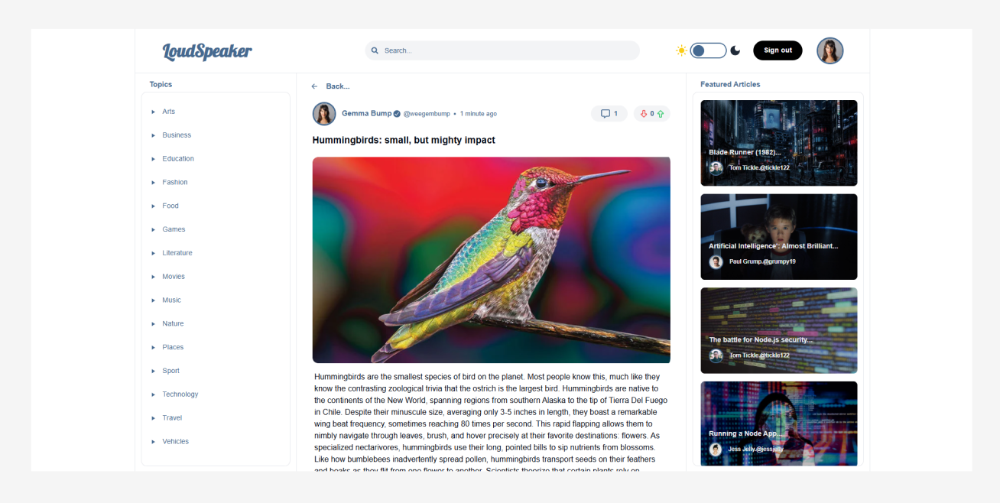

# LoudSpeaker

## Overview

LoudSpeaker is a modern, fully responsive articles platform designed to enhance the user experience of the original nc-news-frontend project from the Northcoders bootcamp. Built as an improved frontend for the nc-news-backend-project, LoudSpeaker allows users to sign in as one of six predefined users to explore, create, and interact with articles. The platform offers robust features like article searching, filtering, commenting, liking, and theme switching, all powered by a custom-built backend.

Visit LoudSpeaker: https://loudspeaker77.netlify.app/

## Features

**User Authentication:** Sign in as one of six predefined users to access personalized features.

**Article Management:** Create, search, and filter articles by various criteria.

**Interactivity:** Comment on articles, like articles, and like comments.

**Theme Customization:** Toggle between light and dark modes for a comfortable reading experience.

**Comment Moderation:** Delete comments as needed.

**Responsive Design:** Seamlessly adapts to desktop, tablet, and mobile devices.

## Technologies Used

**Frontend:** React, Tailwind CSS.

**Backend:** Node.js (via nc-news-backend-project, fully tested).

**Deployment:** Netlify.

## Installation

Clone the Repository:

```bash
git clone https://github.com/LeeConroy1977/LoudSpeaker-FE.git
```

Install Dependencies:

```bash
npm install
```

Run the Application:

```bash
npm run dev
```

Access the Application:Open your browser and navigate to http://localhost:3000.
To view the application in mobile view, open dev-tools and select the device iPhone 6/7/8.

## Usage

**Sign In:** Choose one of the six predefined users to log in.

**Explore Articles:** Scroll the main articles list or use the search bar or filters to find articles by topic, date, or other criteria.

**Create an Article:** Click on the "Compose Article" section, fill in details, and publish.

**Interact:** Like or comment on articles, like comments, or delete your own comments.

**Toggle Theme:** Switch to dark mode via the theme toggle for better readability.

**Responsive Experience:** Access the site on any device for a consistent experience.

## Backend Information

LoudSpeaker relies on the nc-news-backend-project, a fully tested Node.js backend developed during the Northcoders bootcamp.

## Backend Repository

[Link to Backend Repository](https://github.com/LeeConroy1977/nc-news-backend-project)

## Contact

For questions or support, please contact:

Email: leeconroy1977@yahoo.co.uk

## Image Gallery





