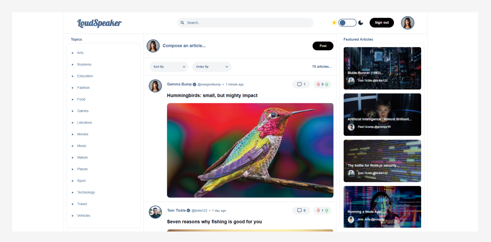

# LoudSpeaker



EventWey is an innovative event and meetup application designed to help users discover, join, and create events and groups in their community. Whether you're looking to organize events or find new experiences, EventWey brings people together seamlessly.

---

## Website

- https://loudspeaker77.netlify.app/

---

## Getting Started

### Prerequisites

- Ensure you have [Node.js](https://nodejs.org/) installed.

### Installation and Setup

1. Clone or fork a copy of the repository to your local machine.

2. Open a terminal and navigate to the project directory.

3. Run the following commands to install the necessary dependencies and start the app:

   ```bash
   npm install
   ```

   ```bash
   npm run dev
   ```

   Open a new terminal in the same directory and start the JSON server on port 3000 using:
   json-server --watch db.json --port 3000

Once both commands are running, you can access the application via your browser.

---

## Main features

- Create groups for users to join

- Create group events that user can join

- Add an event to google calendar

- If an admin user, approve or reject new groups and events

---

## Using the app

To use Eventwey, visitor to the app have 4 options.

**1. Sign up and create a new account.**

Users can create a new account with a username, email and password. New user will then add their profile image, background image, bio, about me and tags to populate their profile page.

**2. Sign in to your existing account.**

If a user has already created an account, they can sign in using their email and password.

**3. Sign in as an existing user.**

A user can also sign in as an existing user by clicking on the existing user profile. If that user is the owner of a group, they can create new events for that group.

**4. Sign in as an existing admin user.**

A user can also sign in as an admin user and can approve or reject newly created events and groups.

---

## Test accounts

**User One**

**Email:** mia6@gmail.com<br>
**Password:** Password#6

**User Two**

**Email:** john2@gmail.com<br>
**Password:** Password#2

**User Three**

**Email:** emma3@gmail.com<br>
**Password:** Password#3

**Admin User One**

**Email:** lucas5@gmail.com<br>
**Password:** Password#5

**Admin User Two**

**Email:** lucy7@gmail.com<br>
**Password:** Password#7

**Admin User Three**

**Email:** sophie10@gmail.com<br>
**Password:** Password#10

---

## How to test the app features

1. Sign up as a new user or sign in as an existing user.

2. Click create a group in the nav bar and follow the instruction to add the group details.

3. Sign out and sign back in as an admin user.

4. In the admin user home page, Click admin in the navbar and click the newly created group and approve.

5. Sign out and sign back in as the user who created the group.

6. Click the create event button and follow the instruction to create an event.

7. Sign out and sign back in as an admin user and approve the newly created event.

8. Click join event and then click add to google calendar.

9. Browse other groups and events and join any that you like!

---
